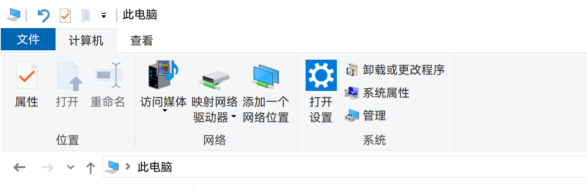
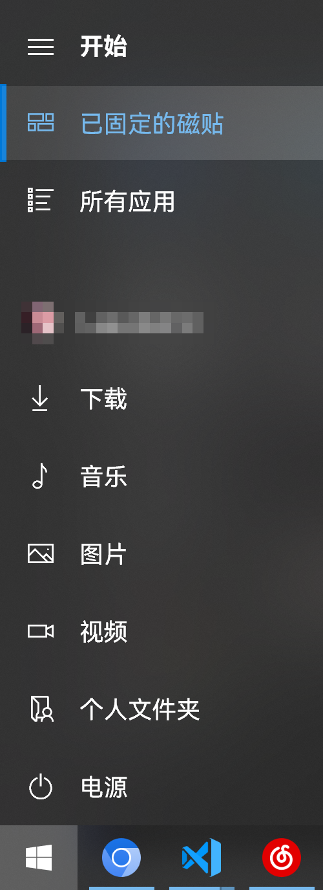
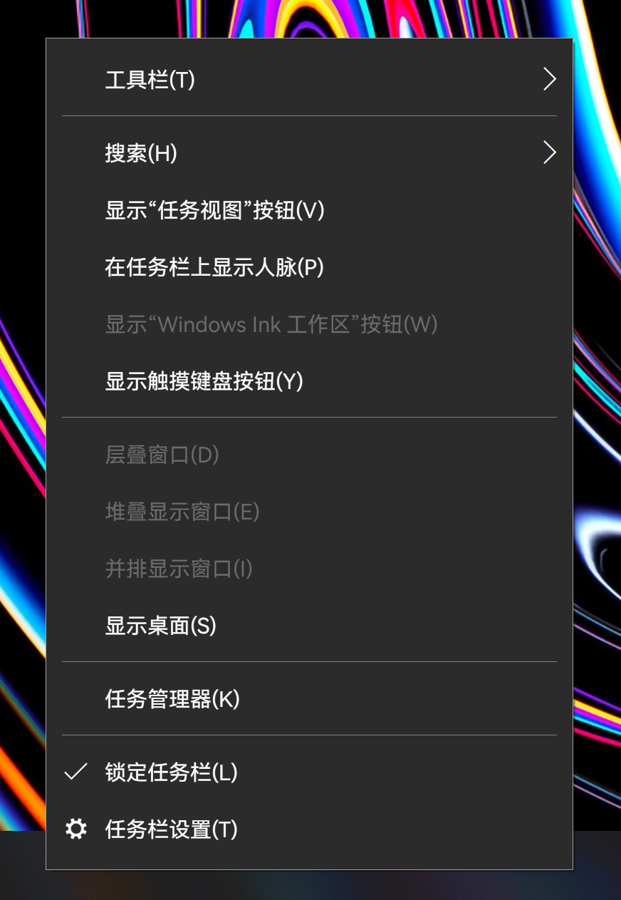

# FontsReplace

基于 [HarmonyOS Sans](https://developer.huawei.com/consumer/cn/design/resource-V1/) 生成可用于替换 Windows 系统字体的字体文件。

> 主要针对简体中文环境 (默认系统字体为微软雅黑) 优化，微软雅黑是专为低分辨率下配合 ClearType 优化笔画清晰度的一个特殊字体，在字形上看起来会比较怪，因此建议在屏幕分辨率大于等于 4K 时替换为其他更为成熟的中文 UI 字体，替换后可有效改善系统观感。也可以搭配 [noMeiryoUI](https://github.com/Tatsu-syo/noMeiryoUI) 和 [MacType](https://github.com/snowie2000/mactype) 进一步优化其他细节效果。

## 替换效果






## 使用方式

> 需要系统中已安装 [uv](https://docs.astral.sh/uv/getting-started/installation/) 和 [Python 3.14](https://www.python.org/downloads/windows/)

```powershell
uv sync
uv run fonts_replace fetch harmonyos
uv run fonts_replace build --preset harmonyos
```

工具会基于当前系统的字体生成一套替换字体，字形使用 HarmonyOS Sans，生成的字体位于 `replacements/`。

## 替换系统字体

系统运行中无法直接替换字体，需要通过高级启动进入 [WinRE 命令提示符](https://support.microsoft.com/en-us/windows/windows-recovery-environment-0eb14733-6301-41cb-8d26-06a12b42770b)，使用 `xcopy` 命令并选择全部覆盖（操作前建议先备份系统字体）：

```bat
xcopy C:\<project_dir>\FontsReplace\replacements C:\Windows\Fonts
```

## 使用其他字体

也可以编写一个自定义 TOML 配置来使用自定义字体，字体需要是 TrueType 字体（`.ttf` 或 `.ttc`）。

1. 在项目目录中新建 `fonts` 文件夹，放入字体的完整系列（包括各种字重和变体）。
2. 在 `presets` 文件夹中新建 `custom.toml`，填入以下内容：

```toml
input_dir = "../fonts"

[[sources]]
groups = ["en", "zh-Hans", "zh-Hant", "ja"]
files = ["*.ttf", "*.ttc"]
fallback_style = "regular"
```

3. 在项目目录中执行：

```powershell
uv run fonts_replace build --preset custom
```

----

以 [MiSans](https://hyperos.mi.com/font/zh/download/) 为例：

1. 从官网下载 **MiSans**，将字体文件放入 `fonts/MiSans/`，可以包含 `ttf` 以及可变字体。
2. 新建 `presets/misans.toml`，填入：

```toml
input_dir = "../fonts/MiSans"

[[sources]]
groups = ["en", "zh-Hans", "zh-Hant", "ja"]
files = ["*.ttf"]
fallback_style = "regular"
```

3. 在项目目录中执行：

```powershell
uv run fonts_replace build --preset misans
```
